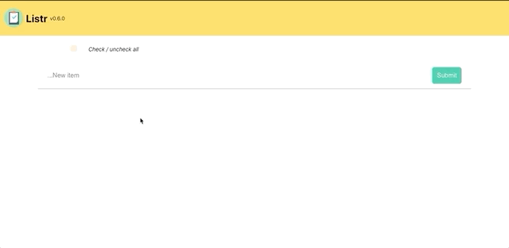

# Listr

A dead simple list app.



## Local Development

```
yarn;
yarn start;
```

This will install dependencies via `yarn` and then start the app. Changes will be watched and refresh the page as changes are made.

### Using docker

Install both `docker` and `docker-compose` if you have not already, and run the following command in the project root folder.

```
docker-compose up
```

## Tests

```
yarn test;
```

## Building / deployment

`yarn build` will create the static bundle - you can then serve it up via any webserver. `yarn deploy` will pull master, run tests, then build.
